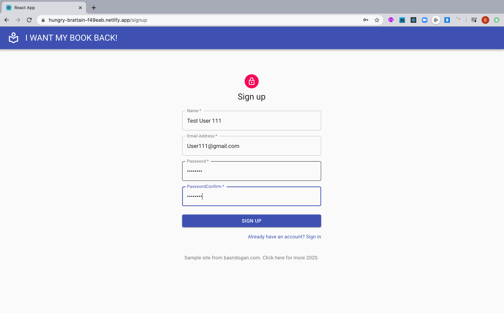
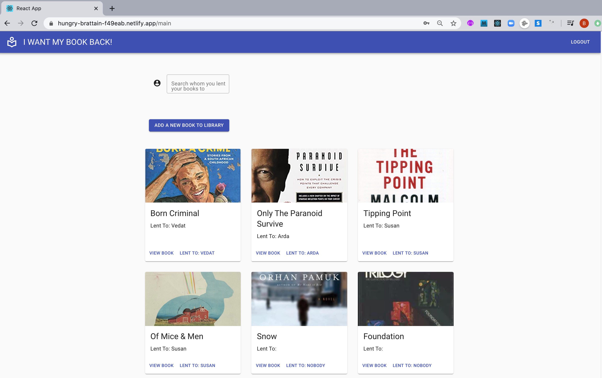
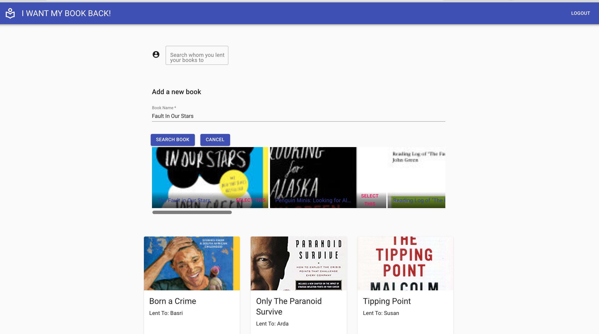
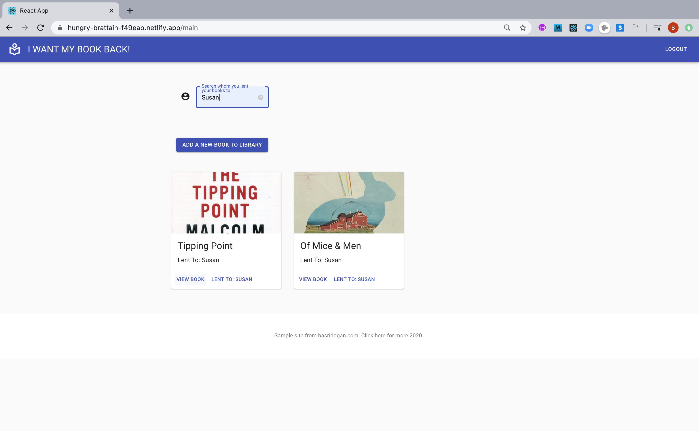
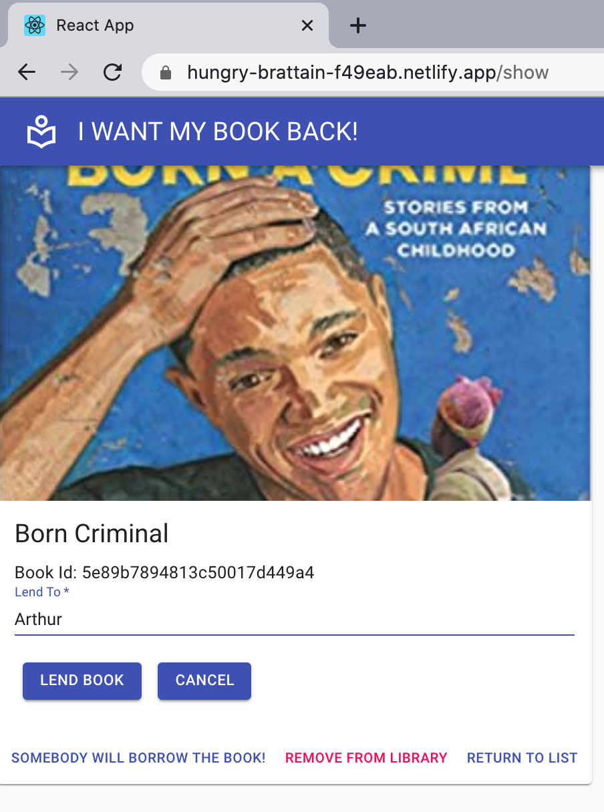

# I Want My Book Back
Users can use the site to keep track of people they have lent their books to.

## Features
- Users can signup, login and logout
- Allows users to create a new book with title and book cover(url)
- User can view book details or delete them
- User has the option to search the books lent to a specific person

## Deployment
Frontend deployed in Netlify here: https://hungry-brattain-f49eab.netlify.app/
Frontend repo here: https://github.com/badogan/testing-wed
Backend in Heroku. Backend code here: https://github.com/badogan/booktracker

## Built With
- React with hooks
- Uses Material UI useStyles() and theme (with minor modification). CSS-in-JS
- Frontend Testing: Jest, testing-library/react
- Frontend CI: Github Actions for CI
- Backend: Nodejs Express, MongoDB(Mongoose), CircleCI 

## Installation
 In the project directory, run:

```bash
npm install
npm start
```
You will need to spin up the backend to this project. Please refer above for backend repo details.

## STEP-1: Landing Page


## STEP-2: Signup Page


## STEP-3: Main Page


## STEP-4: Add Book Functionality


## STEP-5: Filter Functionality


## STEP-6: Book Lending and Return Functionality


## Future Improvements
- Process for the user to "search and select the book" rather than "adding via form" could be implemented 

## Author
Basri Dogan